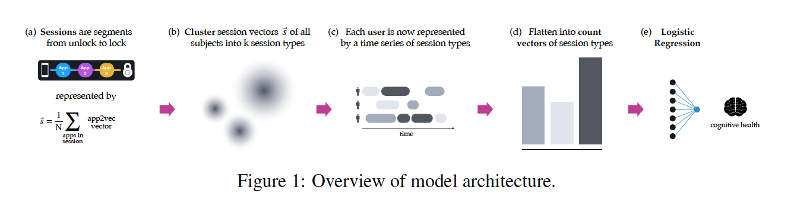
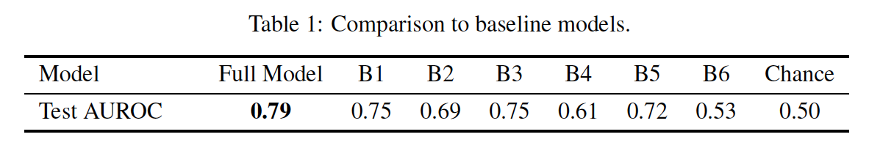
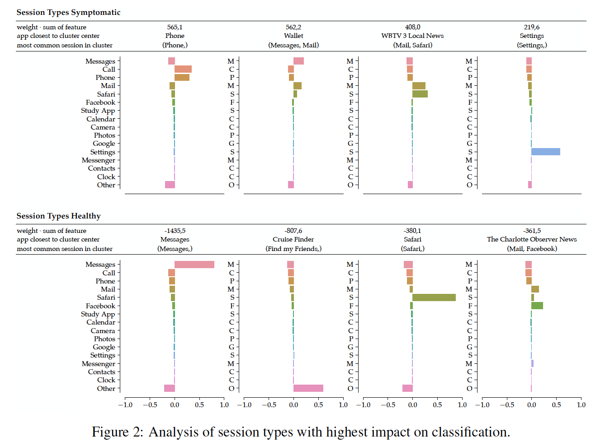
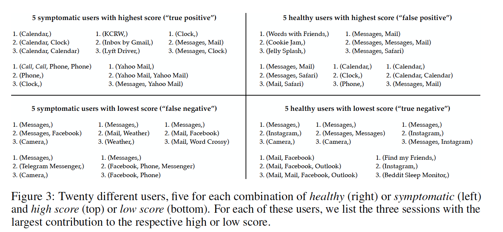

# Paper

-  **Title**: Modeling patterns of smartphone usage and their relationship to cognitive health
-  **Authors**: Jonas Rauber _et al_
-  **Keywords**: AI, Health
-  **Year**: 2019
-  **Link**: https://arxiv.org/pdf/1911.05683.pdf

# Summary

**Question/Goal**: Can cognitive health be modelled using patterns in smart phone usage?

**Methods**: 
- 	Model architecture

-	A subset of the data collected in a 12-week feasibility study which monitored 31 people with clinically diagnosed cognitive impairment and 82 healthy controls in normal living conditions were used.

-	Phone unlock/lock event streams that consist of the time-stamps for all phone unlock and lock events were used. Overall the data amounts to more than 800k app launches and 230k phone unlock events. 

-	To represent the many different apps in the dataset in a way that encodes similarity between apps, a 50-dimensional embedding was trained in the same way as the popular word2vec by considering each user to be a “sentence” and predicting each app from the three apps before and after it in time. To obtain a single vector representation ~s of each session, the embeddings of all apps within each session was averaged.

-	k-means was used to cluster all session vectors in the dataset to identify different session types.

-	A user’s app usage is then represented by a time-series of session types

-	Finally, the time series of each user by counting the session types were summarized, followed by normalization and rescaling. 

-	The features are then used as input to an L1-regularized logistic regressor to classify users as healthy or symptomatic. 

**Experiments/Results**: 

-	Experiments were performed using N leave-one out (LOO) train/test splits. For each N splits, model hyperparameters were selected via a second LOO cross-validation loop on the N-1 training samples.

-	The model parameters consist of the logistic regression weights and the hyper-parameters consist of (i) the number of session types, K, used for the session clustering and (ii) the inverse regularization strength, C, for the logistic regression.

-	Final performance was computed using AUROC of the predicted probabilities from each of the N left out test subjects

-	A systematic evaluation of the impact of each of the different model design choices on the ability to predict cognitive health using ablation studies was carried out. However, the full model gave the best prediction.

-	Analysis of four session types with the highest contribution to the model decision in either direction.

-	The contribution of a session type is measured by the product between the regression weight and the corresponding feature’s value summed over all subjects (weight X sum of feature). To characterize each session type, the app closest to the cluster center was reported, and the most common session in the session type. 

-	In addition, for the 15 most common apps in the dataset, the difference between the app distribution in each session type and the overall distribution of apps in the dataset were visualized with bar plots. 

-	To better understand the model’s prediction for individual subjects, N models resulting from the LOO procedure was used to analyze which sessions cause them to (mis-) classify the respective test subjects.

-	As such, figure 3 shows twenty different users, five for each combination of healthy (right) or symptomatic (left) and high score (top) or low score (bottom). For each of these users, three sessions with the largest contribution to the respective high or low score were listed.

**Conclusions**: 
-	The generalization of our results to the general population will be limited by size of the dataset and the fact that symptomatic subjects were already diagnosed when entering the study.
-	App usage alone captures systematic differences between healthy and symptomatic subjects.
