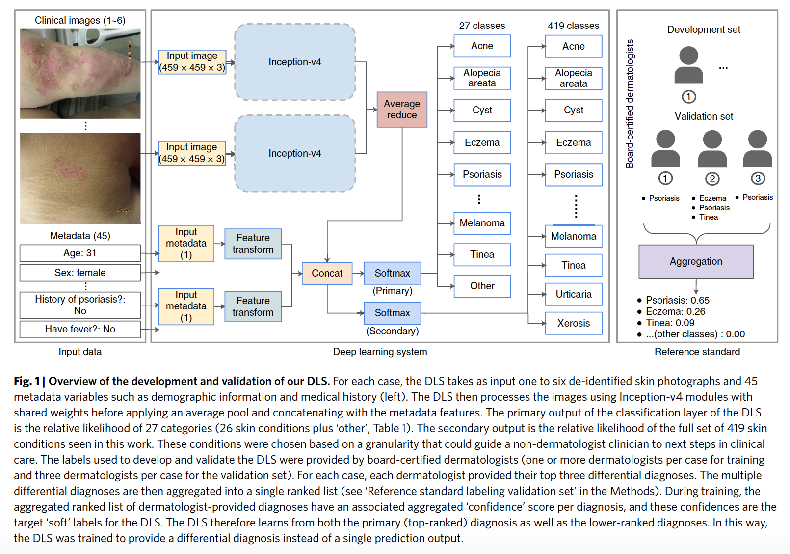
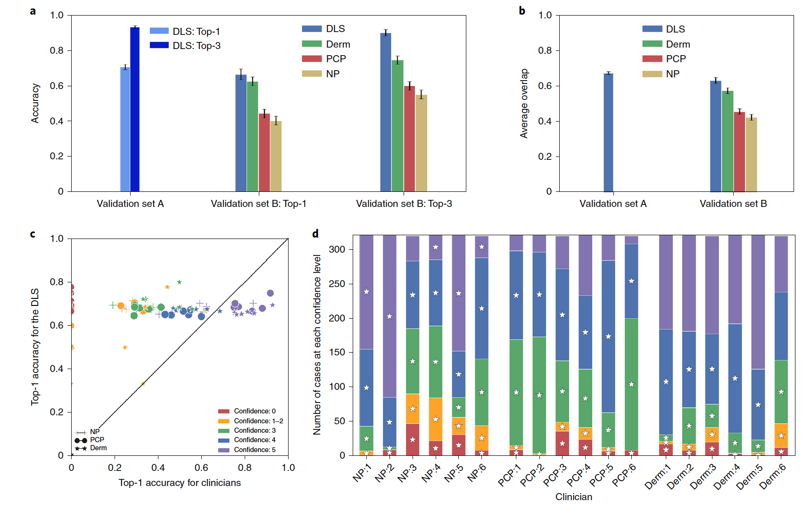
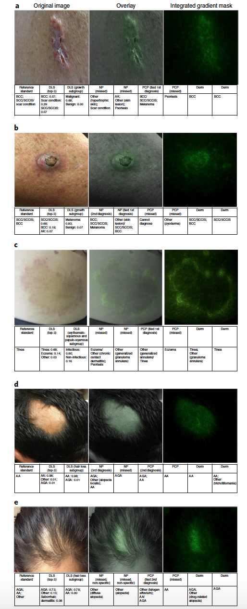
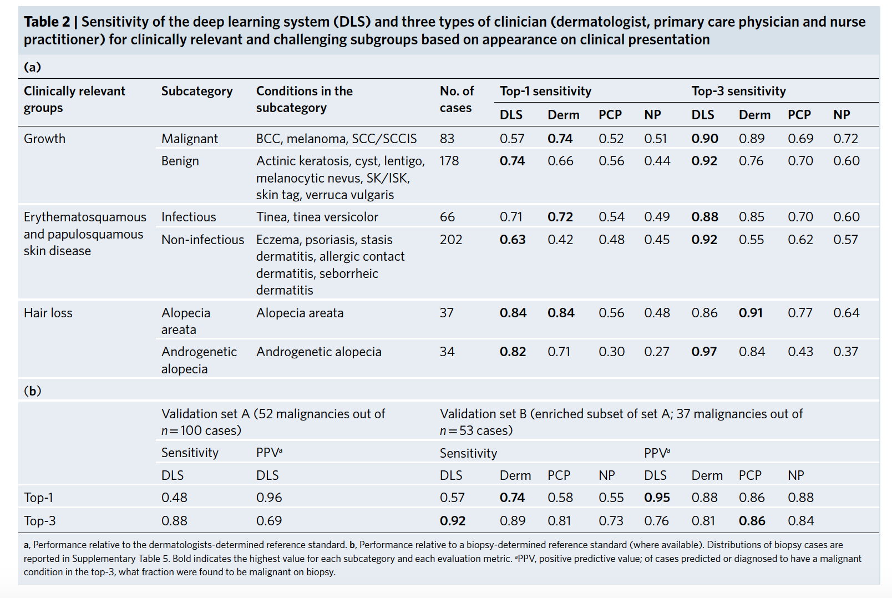

# Paper

-  **Title**: A Deep Learning System for Differential Diagnosis of Skin Diseases
-  **Authors**: Yuan Liu _et al_
-  **Keywords**: CNN, Computer Vision, Medecine
-  **Year**: 2020
-  **Link**: https://www.nature.com/articles/s41591-020-0842-3

# Summary
__Introduction__: There are numerous kinds of skin diseases, and because of the limitation of specialties in detecting them, they are often passed over to non-specialists such as primary care physicians, and physician assistants. And this leads to a low diagnostic accuracy of 24 – 70%. Because of this, tele-dermatology had been introduced so specialist can get to it at their own pace. However, the use of artificial intelligence can be used to achieve this task. In the past, similar AI task as focused on single diagnosis task, however, for this paper, they focused on a full differential diagnosis. 

__Goal__: To identify various skin conditions using a deep learning system (DLS) in adult cases that were referred for 16 tele-dermatology consultation sites.

__Methods:__

- _Dataset_: consists of between 1 and 6 clinical images taken by clinical professionals using a different mix of camera devices for each case. In addition, clinically relevant and demographic metadata were provided such as age, race, skin types, etc. Dataset were split into 80% for development and 20% for validation using a temporal split strategy. The validation dataset was divvied up into two sets: set A and set B, for the purposes of dealing with class imbalances.  After excluding cases with multiple skin conditions and those that were non-diagnosable, 16,114cases (64,837 images) were used for development and 3,756 cases (14,883 images) for validation (validation set ‘A’; a smaller subset ‘B’ was used for comparison). In total, 64,878 dermatologist reviews were collected for development and 11,268 reviews for validation. 

- _Labels_:	Each case is labelled by three dermatologists. To determine the reference standard, the differential diagnoses of the dermatologist were aggregated via a voting strategy, hence voting-based reference standard differential diagnoses. In summary, for each grader, each diagnosis was first mapped to one of 419 conditions then duplicate mapped conditions were removed. Votes for each of these mapped conditions were summed across the three dermatologists based on the relative position of each diagnosis within each dermatologist’s differential. The final differential was thus based on the aggregated votes across three board-certified dermatologists.

- _DLS_: The DLS takes in clinical images and 45 meta-data. Images are processed using inception-v4 modules and concatenated with input meta-data. The DLS has two major components: 1) deep CNN for images and 2) a shallow module for meta-data. The primary output of the DLS is the 27 classes (26 conditions + ‘others’) and 419 classes for the secondary output.  To help the DLS learn to predict a differential diagnosis (as opposed to a pure classification to predict a single label), the target label of the DLS was based on each case’s reference standard differential diagnosis. Specifically, the summed ‘votes’ of each condition in the differential were normalized (to sum to 1), and the DLS was trained using a softmax cross-entropy loss to learn these ‘soft’ target labels. To account for class imbalance, when calculating cross-entropy loss, each class was weighted as a function of its frequency, so that cases of rare conditions would contribute more to the loss function.

- _Training protocol_: The network weights were optimized using a distributed stochastic gradient descent implementation to predict both the full list of 419 conditions and the shorter list of 27 conditions. To speed up the training and improve training performance, batch normalization and pre-initialization from ImageNet dataset were used. Training was stopped after a fixed number of steps (100,000) with a batch size of 8. The development set was also split into a training set to ‘learn’ the neural network weights and a tuning set to select hyperparameters for the training process. Data augmentation was applied to improve generalization and random dropout was applied to metadata features.

- _Evaluation_: To evaluate the DLS performance, predicted differential diagnosis was compared to the ‘voted’ reference standard differential diagnosis using the top-k accuracy and the average top-k sensitivity.

__Experiments/Results:__

- _DLS Performance_: DLS’s top differential diagnosis in validation set A had a ‘top-1 accuracy’ (accuracy across all cases for 26 skin conditions + ‘other’) of 0.71 and a ‘top-1 sensitivity’ (sensitivity computed for the 26 conditions separately and averaged) of 0.58. DLS’s top-3 accuracy is 0.93 and its top-3 sensitivity across 26 conditions is 0.83. Evaluation of the DLS’s overall differential diagnosis using the average overlap (AO) metric yielded 0.68 overall.

- _DLS Performance compared with clinicians_: To compare the DLS performance with that of clinicians, validation set A was randomly subsampled. Eighteen clinicians of three different levels of training (dermatologists, PCPs and NPs, all of whom were board-certified) graded validation set B. On this smaller dataset, the DLS achieved a top-1 accuracy of 0.66, compared to 0.63 for dermatologists, 0.44 for PCPs and 0.40 for NPs. The DLS was non-inferior to the dermatologists at a 5% margin (P < 0.001). The top-3 accuracy was substantially higher at 0.90 for the DLS, compared to 0.75 for dermatologists, 0.60 for PCPs and 0.55 for NPs. In addition, using the AO metric yielded 0.63 for the DLS, compared with 0.58 for dermatologists, 0.46 for PCPs and 0.42 for NPs. When the comparator clinicians’ confidence in their primary diagnosis was lower, the clinicians’ accuracies dropped, whereas the DLS’s top-1 accuracy remained high (Fig. 2c, d). Representative examples of cases that were missed by PCPs or NPs are shown in Fig. 3a–e

Fig. 2 | Performance of the DLS and the dermatologists (Derm), primary care physicians (PCPs) and nurse practitioners (NPs).

Fig. 3 | Representative examples of challenging cases missed by non-dermatologists.

- _Subgroup Analysis_: A sub-group analysis was carried out for difficult and often misidentified skin diseases at clinical presentation (table 2). 

