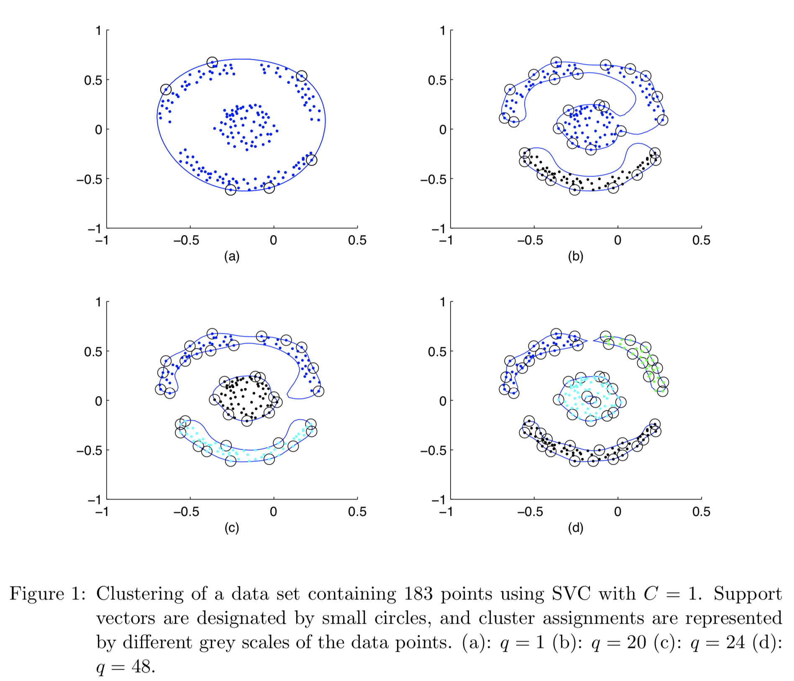
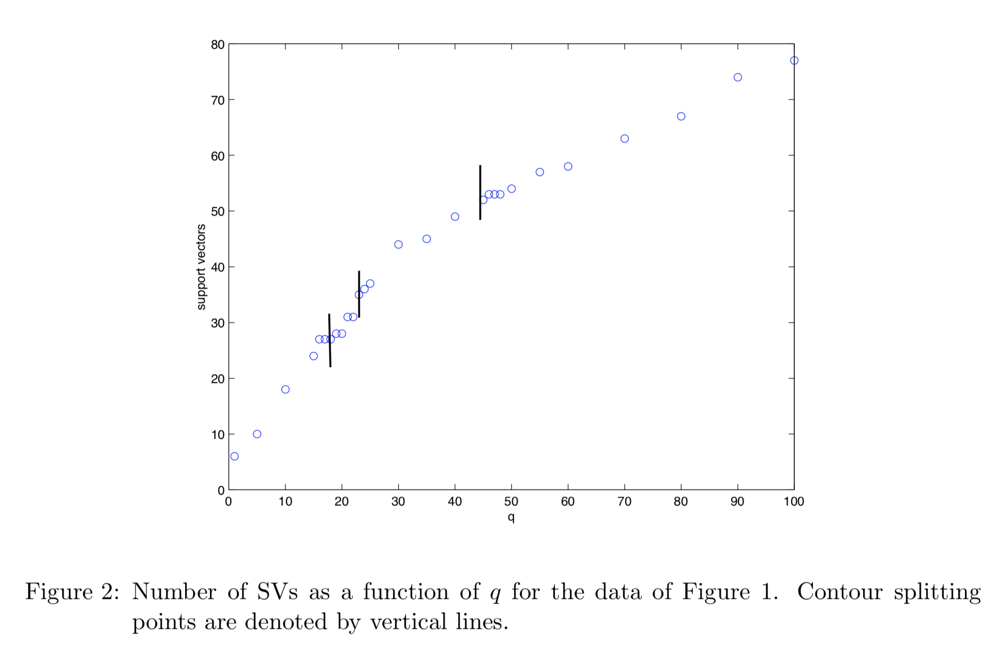
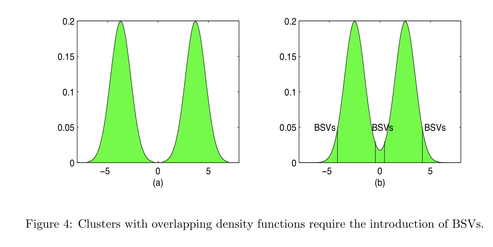
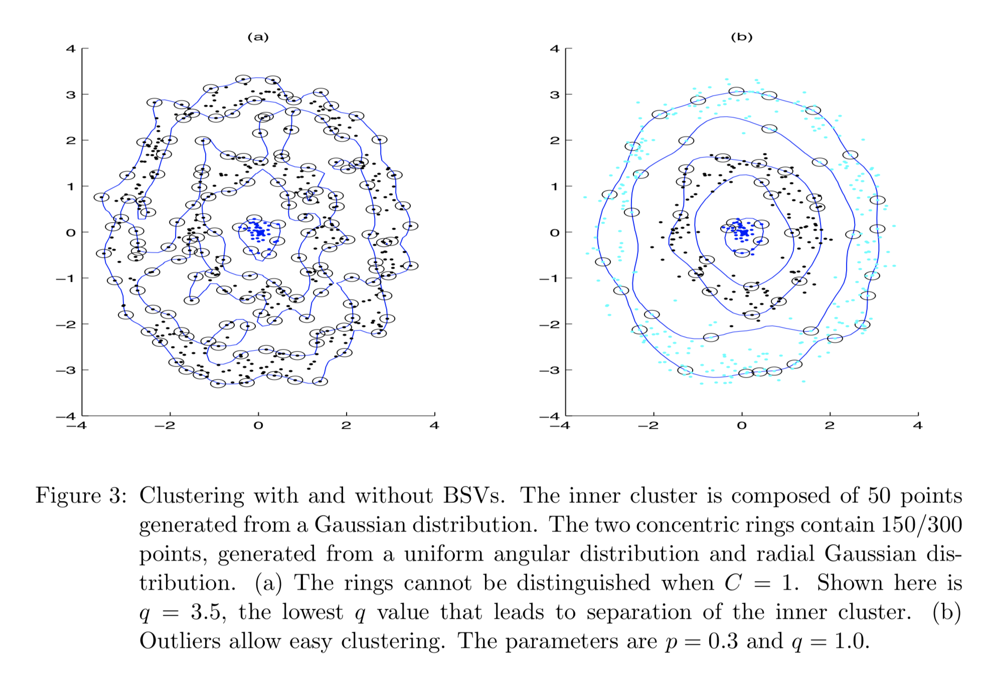
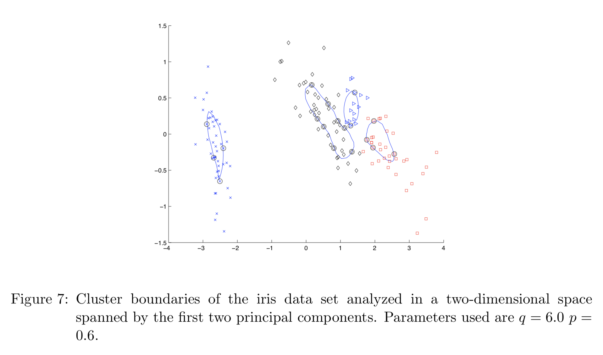

# Paper

-  **Title**: Support Vector Clustering
-  **Authors**: Asa Ben-Hur, David Horn, Hava T. Siegelmann, Vladimir Vapnik 
-  **Keywords**: Support Vector Machines, Clustering
-  **Year**: 2001
-  **Link**:http://www.jmlr.org/papers/volume2/horn01a/horn01a.pdf

# Summary

**Question/Goal**: To describe a clustering method using support vector machines formalism.

**Methods**: SVC is a method that derives from support vector machines (SVM) albeit used for clustering in this context. In SVM, we should recall that the goal is to take a dataset that cannot be linearly separable by a hyperplane from the original data space to a higher-dimensional space. This is done using various kind of kernel functions such as polynomial kernel and radial basis functions (Gaussian) kernel. In summary, SVC use a Gaussian kernel for mapping data points to higher dimensions. Polynomial kernel was not used because they do not yield tight contours representations of a cluster.
-  Features are mapped from the original dataspace to a higher dimensional feature space looking for the smallest enclosing sphere of radius R. 
-  To solve the optimization problem, they introduced the Lagrangian
-  Support vectors (SV) lie on cluster boundaries, bounded support vector (BSV) are outside, and all other points lie inside the clusters. 

**Results**: 
- Shape and definition of the clusters are largely influenced by the soft margin C, and scale parameter, q of Gaussian kernel. For example, the number of clusters defined increases with increase in q as shown in figure 1.  

- The relationship between scale parameter q, and the support vectors SV, showing that the number of support vector increases as q increases, and hence contour splitting (figure 1). 

- In the real world however, outliers are ubiquitous, and the presence of outliers might prevent the smooth definition of clusters. To solve this problem BSV are deployed.  

- The figure below shows clustering with and without BSV and (b) shows the power of BSVs

- The algorithm was also shown to be useful for clustering overlapping clusters. And finally, they attempted the SVC algorithm on the iris data set. The clustering in the first two principal components led to the breaking apart of the third clusters into two making four in total (q = 6, p = 0.6, figure below). By increasing the number of principal components, the three clusters were conserved but not without some misclassifications:  

- In summary, SVC is a clustering method with 1) two parameters (soft margin constant and the scaling parameter of the Gaussian kernel) and 2) unsupervised with respect to the number of clusters. 

