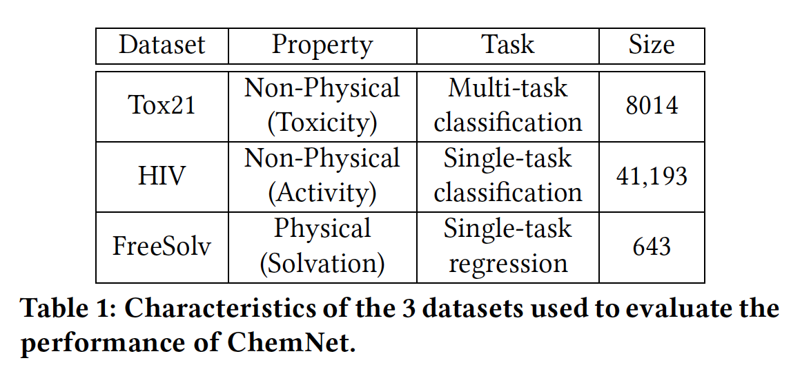
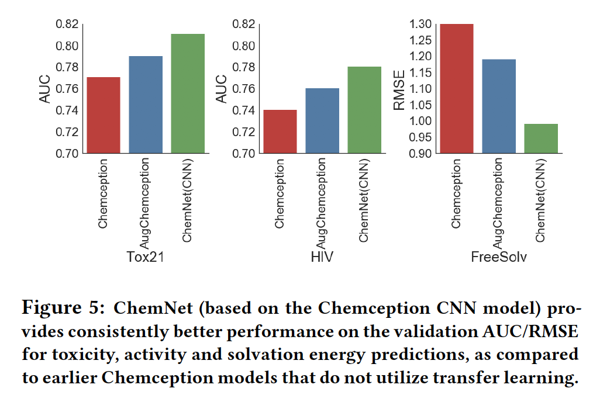
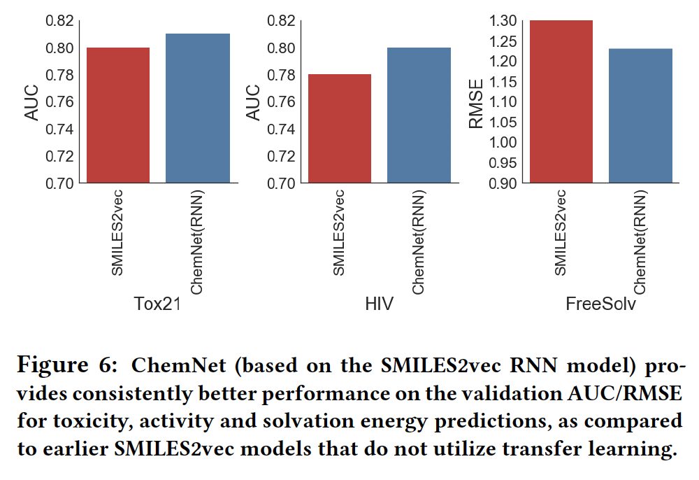

# Paper

-  **Title**: Using Rule-Based Labels forWeak Supervised Learning: A ChemNet for Transferable Chemical Property Prediction
-  **Authors**: Garre B. Goh, Charles Siegel, Nathan Hodas, and Abhinav Vishnu
-  **Keywords**: CNN, RNN, Transfer Learning, Chemical Tasks
-  **Year**: 2018
-  **Link**: https://arxiv.org/pdf/1712.02734.pdf

# Summary
__Question/Goal__: In chemistry, dataset is usually small and fragmented. This is due to the immense amount of time and resource that goes into the generation of such data. However, this contrasts with the ubiquity of, say, photos/images which makes it much easier to carry out classifications using neural networks. In this paper, they sort to build a transferable and generalizable deep neural network that help in classifying smaller datasets via transfer learning.

__Methods:__
- Leveraging on rule-based knowledge obtained from prior feature engineering research in chemistry (molecular descriptors), they trained NN on a large database (ChEMBL), before fine-tuning on a smaller dataset.  

- _Idea_: The logic is the following: by using rule-based features to teach chemistry representations with large datasets, this could be helpful for better initialization of the weights of the network when fine-tuning on smaller and unrelated datasets. 

- _Approach_:	In the first approach, a CNN-based model is used to learn the chemistry representations of molecules in the database using images of molecular drawings. Another approach is by using SMILES2vec, an RNN-based model that learns chemical representations from SMILES – a text-based representation of chemical structures. 
- _Pretraining_: ChemNet was first trained using the ChEMBL database with ~1,700,000 compounds used. For the pre-training, RDKit was used to compute about 100 2D descriptors.
- _Dataset for performance evaluation_: after pre-training, the model was fine-tuned and evaluated on the following smaller datasets

- _Data prep_: For Chemception model, SMILES strings for molecules were converted to respective 2D molecular structures using RDKit, which is then converted into a chemical image data. For SMILES2vec model, chemical text data were created. 
- _Data Splitting_: 5-fold cross validation was carried out for the training datasets, while the validation set was used for performance evaluation and early stopping criterion. 

__Experiments/Results:__

- _ChemNet Model Exploration_: amongst the network architectures tested in the work, a deep and narrow T3 F16 architecture provides the best performance when generalizing to unseen chemical tasks.

- _Transferability of Learned Representations_: From experiments, it was discovered that the first half of ChemNet developed basic chemical representations that are transferable to other chemical tasks, while the other half contains complex representations that are needed to be fine-tuned for specific chemical tasks.

- _Performance gain from ChemNet transfer learning_: using the best ChemNet model and the best fine-tuning protocols, comparison were made with Chemception models that do not use transfer learning protocols, and with AugChemception (which refers to the modification of using augmented images).  Results show that the transfer learning techniques used in ChemNet provide a non-trivial improvement to model performance even when all other factors are held constant.

- _ChemNet on Other Data Modalities_: To show that the ChemNet approach is not unique to just CNN-based models and images, a pre-trained SMILES2vec (an RNN-based model that uses SMILES strings as inputs), was used. The results (shown below) indicate that the ChemNet pretraining approach provides consistent performance improvement that is independent of the network’s architecture and data modality.

