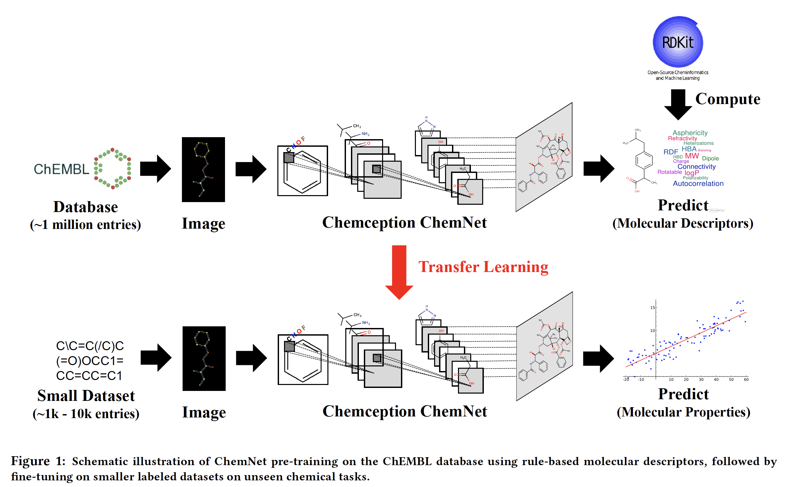

# Paper

-  **Title**: Using Rule-Based Labels forWeak Supervised Learning: A ChemNet for Transferable Chemical Property Prediction
-  **Authors**: Garre B. Goh, Charles Siegel, Nathan Hodas, and Abhinav Vishnu
-  **Keywords**: CNN, RNN, Transfer Learning, Chemical Tasks
-  **Year**: 2018
-  **Link**: https://arxiv.org/pdf/1712.02734.pdf

# Summary
__Question/Goal__: In chemistry, dataset is usually small and fragmented. This is due to the immense amount of time and resource that goes into the generation of such data. However, this contrasts with the ubiquity of, say, photos/images which makes it much easier to carry out classifications using neural networks. In this paper, they sort to build a transferable and generalizable deep neural network that help in classifying smaller datasets via transfer learning.

__Methods:__
- Leveraging on rule-based knowledge obtained from prior feature engineering research in chemistry (molecular descriptors), they trained NN on a large database (ChEMBL), before fine-tuning on a smaller dataset.  

- _Idea_: The logic is the following: by using rule-based features to teach chemistry representations with large datasets, this could be helpful for better initialization of the weights of the network when fine-tuning on smaller and unrelated datasets. 

- _Approach_:	In the first approach, a CNN-based model is used to learn the chemistry representations of molecules in the database using images of molecular drawings. Another approach is by using SMILES2vec, an RNN-based model that learns chemical representations from SMILES – a text-based representation of chemical structures. 
