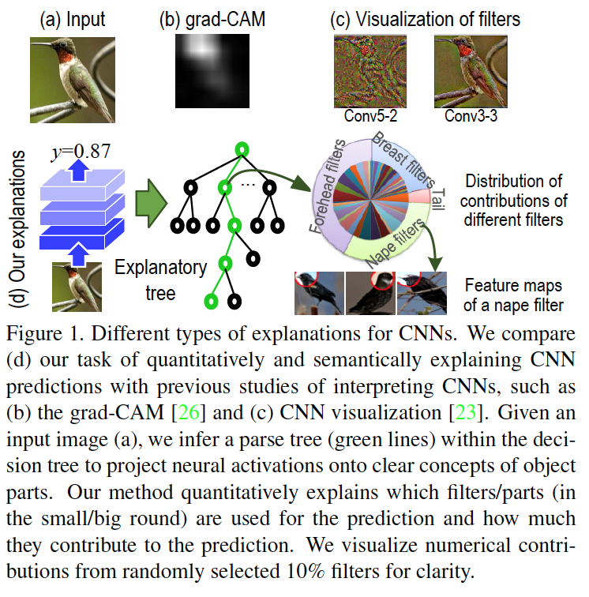
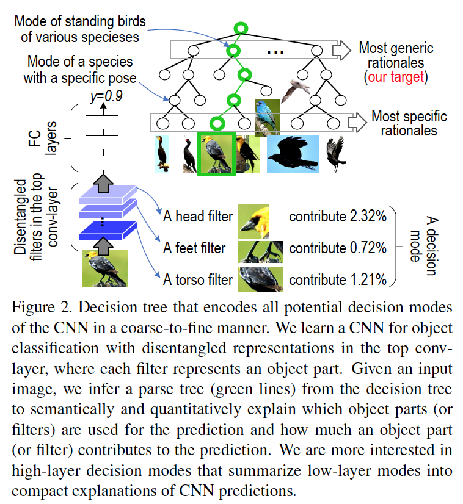
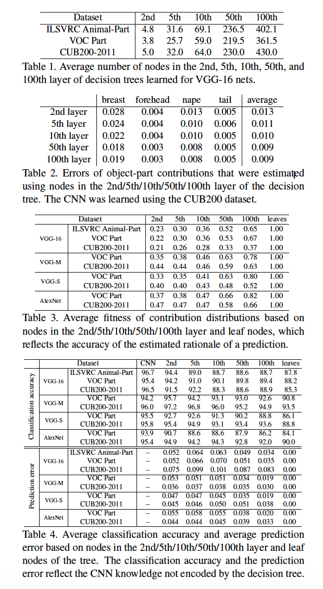
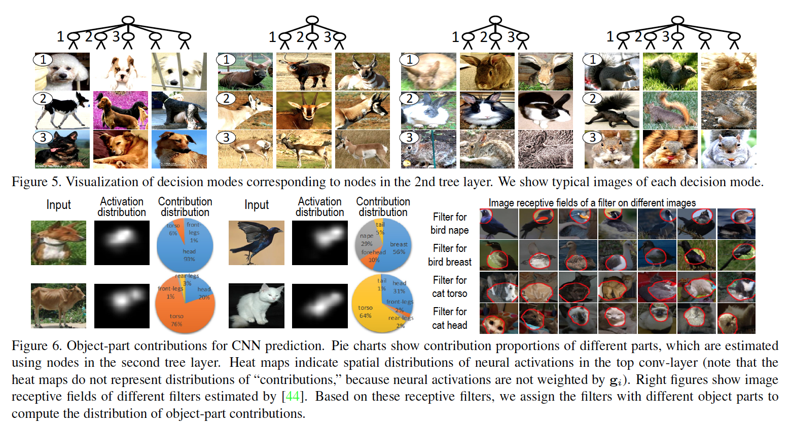

# Paper

-  **Title**: Interpreting CNNs via Decision Trees
-  **Authors**: Quanshi Zhang, Yu Yang, Haotian Ma, and Ying Nian Wu
-  **Keywords**: CNN, Interpretability, Decision Trees
-  **Year**: 2019
-  **Link**: https://arxiv.org/pdf/1802.00121.pdf

# Summary

**Question/Goal**: How does CNN makes predictions? And can it be explained quantitatively?

**Methods**:

- To achieve this goal, two general sub aims are defined: 1) transform chaotic features of 
filters inside a CNN into semantically meaningful concepts, such as object parts, so as to 
help people to understand the knowledge in the CNN; 2) identify which filters/parts pass their 
information through the CNN and contribute to the prediction output. 

- The method proposed an essentially different method from the traditional pixel-level visualization 
and diagnosis of CNN features.

- Bridging middle-layer features with semantic concepts: the first goal is to learn more interpretable 
feature representations inside a CNN and associate each neural activation inside a CNN with a semantic 
concept. This association enables linguistic descriptions of middle-layer knowledge.

- Bridging middle-layer features with final CNN predictions: to quantitatively explain how the 
CNN uses these middle-layer features to compute prediction scores.

- The rationale for CNN predictions on all images is categorized into various decision modes, where 
each node in the decision tree represent a decision mode. Note that decision modes are the common 
rationales of prediction that are shared between images.  Therefore, the decision tree represents 
a hierarchical representation of the decision modes. At the root node, the decision modes shared 
the most between images is represented while for the closest nodes to the leaves, we have modes shared 
by a few. The leave node represents the decision mode of a particular image. 

- To learn decision trees, filters were learnt in order to represent object parts. 
Filters are then assigned to a particular specific part name. Finally, decision tree was constructed 
in order to explain how the CNN use the parts/filters for prediction. 

- Therefore, when the CNN makes the prediction of an image, the decision tree infers a parse tree 
as presented as the green lines in the figure above explaining the prediction, quantitatively. 
Showing the amount of object part/filter that contributes to the prediction score. 

- Generic nodes in the high-level nodes are more of interest as they represent significant 
rationales for CNN predictions.

**Experiments/Results**:

- Four disentangled CNN based on the four benchmatch CNN were learnt: including the AlexNet, 
the VGG-M network, the VGG-S network, the VGG-16 network. 

- Three bench match datasets with ground-truth annotation were used: PASCAL-Part Dataset, 
the CUB200-2011 dataset, and the ILSVRC 2013 DET Animal-Part dataset.

- And the evaluation has two aspects. 1) evaluating the prediction rationale (Errors of 
object-part contributions and the fitness of contribution distributions.) 2) information 
loss of using the decision trees (classification error and prediction error). 

- Table 1 above shows the structure of the tree. Tables 2 and 3 use errors of object-part 
contributions and the average fitness of contribution distributions, respectively, 
to evaluate the accuracy of the estimated rationales based on nodes in different tree layers. 
Table 4 evaluates the information loss when we use the decision tree to represent a CNN. 
Metrics of the average classification accuracy, the average prediction error are used for evaluation. 
Figure 5 visualizes decision modes in the decision tree while Figure 6 shows distributions of 
object-part contributions to the CNN prediction, which were estimated using nodes in the 
second layer of decision trees.  
