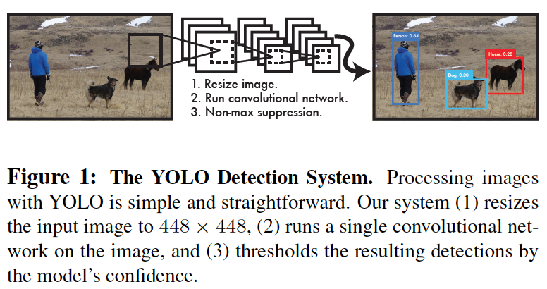
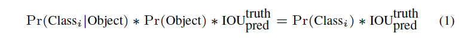
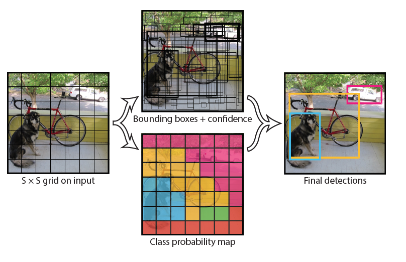
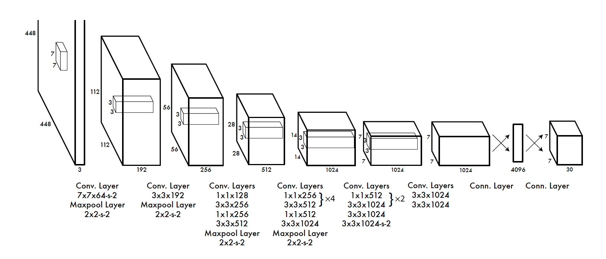
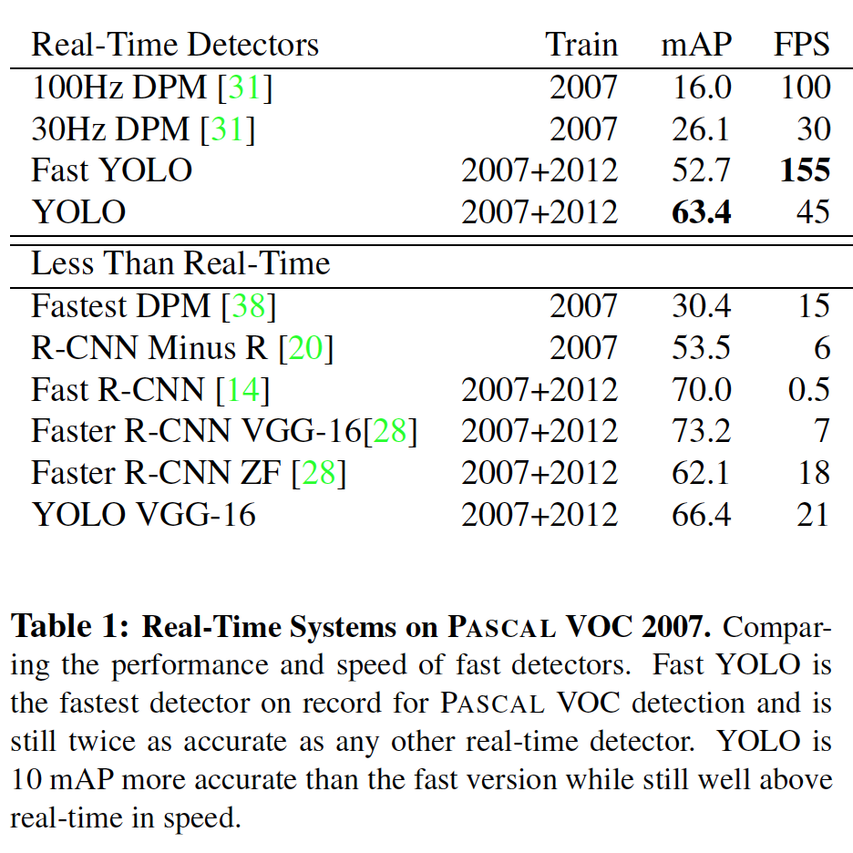
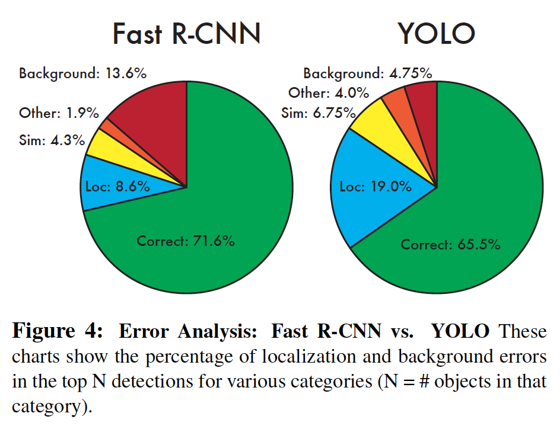
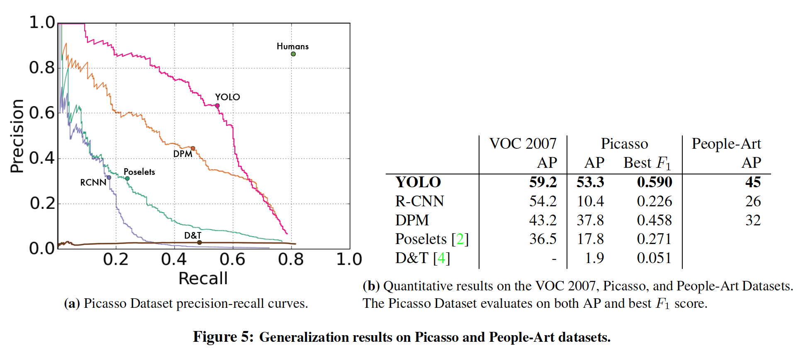
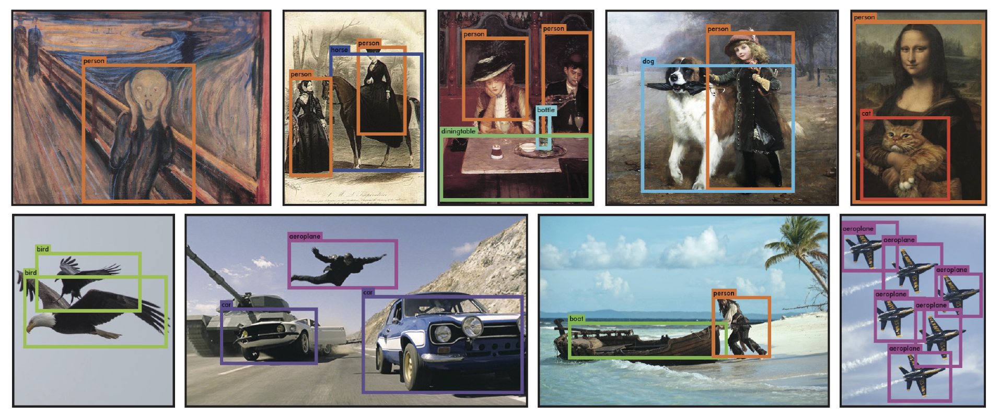

# Paper

-  **Title**: You Only Look Once: Unified, Real-Time Object Detection
-  **Authors**: Joseph Redmon, Santosh Divvala, Ross Girshick, Ali Farhadi
-  **Keywords**: CNN, Computer Vision
-  **Year**: 2016
-  **Link**: https://arxiv.org/pdf/1506.02640.pdf

# Summary

**Question/Goal**:
- Development of an accurate and fast algorithms that can detect of objects in real time. 
- They sort to improve upon the current state of the art object detection algorithms at the time, 
for example deformable part models (DPM) and R-CNN. These methods are not only computationally expensive, 
but also can be slow and hard to optimize.

**Methods**:
- DPM leverage on looking at images using a sliding window approach, observing the defined grid cells as it 
moves across images; while R-CNN proposes a box region around an object, classifies it using CNN, 
followed by post-processing steps. In You Only Look Once (YOLO), the author transformed the object detection 
problem into a regression problem where spatially separated bounding boxes are generated with their 
associated class probabilities. 

- An image is inputted into a S X S grid cell. The goal of each grid cell is to predict B, 
whether the grid cell contains a bounding box and a confidence score that indicate if the grid 
cell contains an object. In addition, it’s predicts C, a conditional probability for class membership 
contingent on the presence of an object. Only one C is predicted per grid cell independent of the 
number of bounding boxes. This is given by the following equation: 

Pictorially, the model is explained as such: 

Predictions are encoded as a S * S * (B * 5 +C) tensor. 

- Convolutional neural network models are used, and models were tested on the PASCAL VOC dataset. 
The architecture of the model was inspired by GoogLeNet with 24 convolutional layers followed by 2 
fully connected layers; and alternating 1 X 1 convolutional layers were used to reduce the features 
space from previous layers. In addition, they trained a FAST version of YOLO with a shallower neural 
network for fast object detection.

- The final output of the network is a 7 X 7 X 30 tensor of predictions.
- A linear activation function in the final layer was used to predict the class probabilities and 
bounding box coordinates. ReLu was used in our layers. 
- A sum-squared error of the model’s output was used as the loss function.
- The network was trained on 135 epochs using a batch size of 64, momentum of 0.9, 
and a decay of 0.0005. For the learning rate scheduling, they used a gradation of 10e-3 to 10e-2 
for the first epochs, 10e-2 for 75 epochs, 10e-3 for 30 epochs and finally 10e-4 for 30 epochs. 
Dropout and data augmentation was carried out to prevent overfitting.

**Experiments/Results**: 

- YOLO was compared to real time detection systems using the PASCAL VOC 2007 dataset. 

- To observe the breakdown of the results an error analysis on the VOC 2007 experiment was carried out.  
YOLO had problems localizing objects, Fast R-CNN makes lots of background error. 

- Because of the limitation of academic datasets, to test generalizability, person detection 
in artwork was carried out using the Picasso datasets and the people-art datasets via a comparative analysis. 
YOLO is comparatively better.

- Some qualitative results on artwork and natural images from the internet.

- Finally they discussed real time detection in the wild, and providing a demo link: http://pjreddie.com/yolo/

**Conclusions**: 

- YOLO is extremely fast. 
- YOLO only looks at the image once 
- YOLO is more generalizable. 

