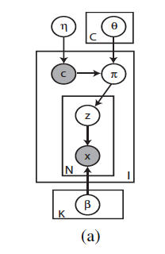
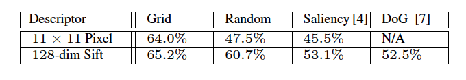

# Paper

-  **Title**: A Bayesian Hierarchical Model for Learning Natural Scene Categories
-  **Authors**: Li Fei-Fei, Pietro Perona
-  **Keywords**: Bayesian Model, Computer Vision
-  **Year**: 2005
-  **Link**: http://vision.stanford.edu/documents/Fei-FeiPerona2005.pdf

# Summary

**Question/Goal**: 
- The categorization of scene without the initial manual labelling of objects in the scene. 
- Previous methods had utilized a supervised intermediate representation of features locally and globally. This makes it sub-optimal given hours of manual labeling and subjectivity that might be inherent in labelling. Hence, it’s expensive, time-consuming, and potentially inefficient.

**Methods**:
- The method used include a learning phase and a recognition phase. In the learning phase, images were represented in local patches using grids, and these are in turn used to form bag of codewords. Learning is done by a Bayesian hierarchical models for each class. When presented a new image for classification; extraction of local features is carried out to form a bag of codewords, and the trained model is used for recognition.

- The model used was a generative graphical model. In summary, c represents the category (label) of an image; pie represent the mixing parameters for the themes, determines the distribution of the intermediate themes;  θ is the dirichelet parameter for each category; z are the intermediate themes; x as patch-level variables. β is a parameter that has the dimension of the number of themes (K) by the total number of codewords in the bag of codes (T). The goal of the learning process is to estimate parameters θ and β for the training dataset. These are the priors over the mixing parameters and distribution over each topic of codewords. 

- 	After learning the model parameters, then given a new image the classification algorithm is the following: 
c = arg⁡max⁡ p(x | c, θ, β) 

That is, the class that maximizes the likelihood of the image over the stated parameters. 

**Results**:

- They experimented with different types of local region representations using the following methods: evenly sampled grid, randomly sampling, kadir & brady saliency detector, and Lowe’s DoG detector. The Grid method performed best. 

- The author carried out a 13-class categorization with 9 indoors and 4 outdoors categories. 100 training and 50 test examples were used for each category. The figure below shows the classification performances of the model via a confusion table. It plots the ground truth class against the prediction, and perfect classification would have a confusion table with a white diagonal. Note that the chance of a random correct classification given a 13-class classification problem is 7.7%, however the average performance of this classification problem is ~64%. However, the top two best classification performance is 82.3%

