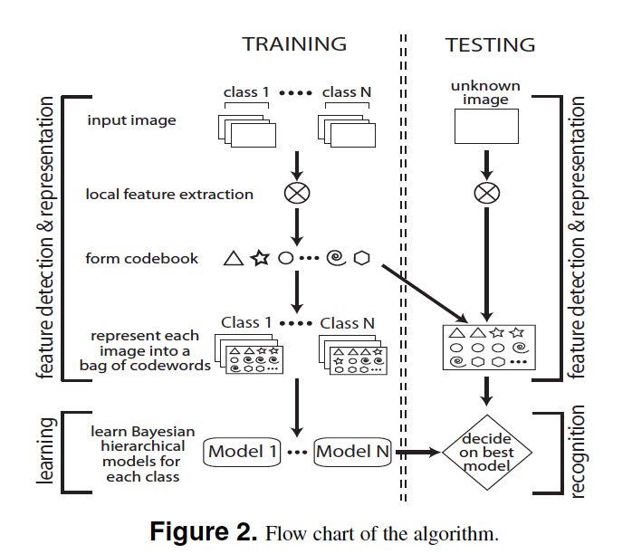

# Paper

-  **Title**: A Bayesian Hierarchical Model for Learning Natural Scene Categories
-  **Authors**: Li Fei-Fei, Pietro Perona
-  **Keywords**: Bayesian Model, Computer Vision
-  **Year**: 2005
-  **Link**: http://vision.stanford.edu/documents/Fei-FeiPerona2005.pdf

# Summary

**Question/Goal**: 
- The categorization of scene without the initial manual labelling of objects in the scene. 
- Previous methods had utilized a supervised intermediate representation of features locally and globally. This makes it sub-optimal given hours of manual labeling and subjectivity that might be inherent in labelling. Hence, it’s expensive, time-consuming, and potentially inefficient.

**Methods**:
- The method used include a learning phase and a recognition phase. In the learning phase, images were represented in local patches using grids, and these are in turn used to form bag of codewords. Learning is done by a Bayesian hierarchical models for each class. When presented a new image for classification; extraction of local features is carried out to form a bag of codewords, and the trained model is used for recognition.

- The model used was a generative graphical model. In summary, c represents the category (label) of an image; \Uppi represent the mixing parameters for the themes, determines the distribution of the intermediate themes;  \theta is the dirichelet parameter for each category; z are the intermediate themes; x as patch-level variables.  is a parameter that has the dimension of the number of themes (K) by the total number of codewords in the bag of codes (T). The goal of the learning process is to estimate parameters  and  for the training dataset. These are the priors over the mixing parameters and distribution over each topic of codewords. 

